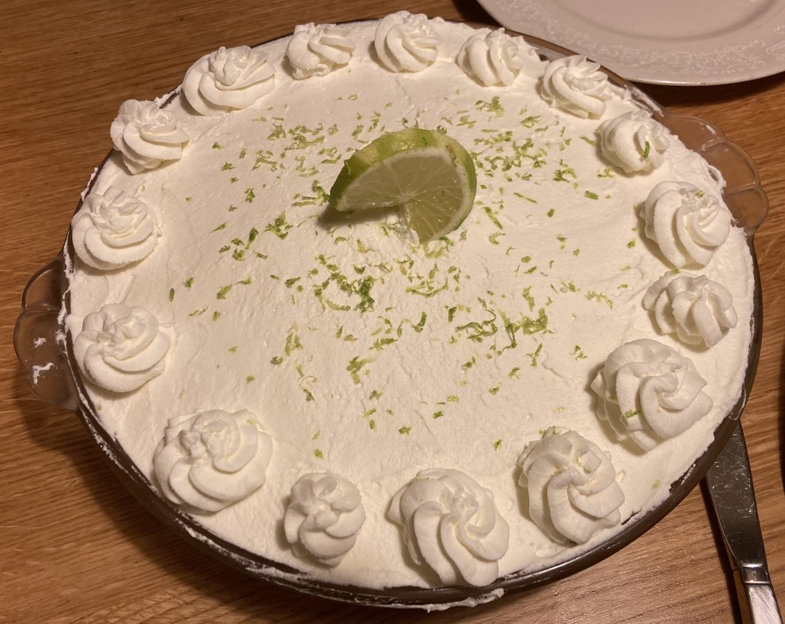

.. index::
   single: pie; key lime

Key Lime Pie
====================

.. ingredients::

   For the pie crust:

   - 18 Graham crackers
   - 1/3 cup melted butter

   For the filling:

   - 2 cans sweetened condensed milk (about 800 grams total)
   - 5 egg yolks
   - 1 cup key lime juice

   For the whipped cream:

   - 1 pint heavy cream
   - 1 tsp. vanilla
   - 2-3 Tbsp. powdered sugar

.. procedure::

   Mash Graham crackers until very fine.  I often do this smashing them up in the bag they come in by hand and then using a rolling pin.  (Mix with sugar, if desired.)
   Mix in melted butter.
   Put this mixture into a pie tie and pat it down so it covers entire pie dish (it should probably be 1/4-1/3 inch thick).
   Refrigerate crust until firm (at least 30 minutes).

   In another bowl, mix the condensed milk, egg yolks, and key lime juice.
   Pour into refrigerated crust.
   Bake in a preheated over at 350 degrees Fahrenheit for 15-20 minutes, until the filling is set.
   Let cool and refrigerate.

   Whip cream and gradually add vanilla and sugar once it's almost done.  This needs to be whipped well in order to keep its shape for several days.
   Spread whipped cream on top of key lime layer once it's chilled.

.. note::

   If key limes aren't available, regular limes work well too.  We also tried with lemons, and it still tasted good (more custardy) but we prefer with limes.  Squeezing the citrus ourselves (even if it's then frozen) tastes way better than buying key lime juice from the store.
   We tried experimenting with making our own Graham crackers and sweetened condensed milk each once, and I'd like to do that again to have more control over the sweetness. You can add a bit less sweetened condensed milk than is listed in this recipe, but 1 can was too little and messed up the consistency.
   There is a variation where you can use slightly fewer eggs (3-4?) and separately beat the whites before adding that to the pie filling.  It gives a lighter filling that doesn't need the whipped cream as much. It is also delicious, just pretty different than the regular recipe.

.. sectionauthor:: Tori
